# 🛠️ RapidFix - On-Demand Real-Time Home Services Matching Platform

[](backend/test)
[](frontend)
[](frontend)
[](backend)

RapidFix is a state-of-the-art, real-time matching platform connecting customers needing emergency or daily home services with background-verified specialists in their neighborhood. Designed with a premium, frosted glassmorphic UI, dynamic scroll-spy navigations, GSAP micro-animations, and a highly resilient state-machine backend, it ensures frictionless booking, communication, and resolution.

---

## 🚀 Key Premium Features

### ⚡ 1. Real-Time WebSocket-Driven Job Dispatch
- **Categorized Matching**: Requests are broadcasted dynamically to worker feeds depending on their specialty (Plumbing, Electrical, Mechanical, Technical).
- **Other Category Bypass**: Requests raised as "Other" bypass traditional trade filters and are instantly broadcasted to all workers within geographic radius limits.
- **Push Notification Broadcasts**: Changes in request states (claims, progress, resolutions) are emitted instantly via Socket.io to keep dashboards perfectly in sync.

### ⏱️ 2. Resilient 5-Minute Confirmation Loop
- **Claim Window**: Once a worker claims a job, a 5-minute confirmation timer starts. 
- **Customer Decision Panel**: The customer dashboard displays the worker's profile image, verified badge tier, star ratings, and complaint history, with options to **Confirm** or **Decline**.
- **Auto-Acceptance**: If the customer takes no action within 5 minutes, the request auto-accepts to ensure worker dispatch is never blocked.
- **Crash-Resistant Recovery**: Expiration timers are checked and synchronized on any database feed load, ensuring pending timers remain accurate across server restarts.

### 🗺️ 3. Progressive "Worker Travel & Arrive" Flow
To prevent workers from arriving unannounced or customers losing track of service states:
1. **Intimate Coming**: Clicking **"Intimate I will come soon"** triggers a real-time "Worker is on the way" SMTP email notification to the customer.
2. **Arrived & Start**: The button updates to **"Arrived & Start Work"** upon traveling. Clicking this updates the database status to `"in progress"` and emails arrival details.
3. **Receipt Resolution**: On completion, the worker inputs the total cash received, resolving the request and triggering a completion receipt email with payment totals.

### 🎖️ 4. Multi-Tier Worker Trust Badges
Worker profiles automatically derive dynamic badge tiers depending on their profile and work history:
- **Verification Pending**: Email or phone number has not been verified.
- **Verified**: Email AND phone numbers verified.
- **Verified Pro**: Government identity documents approved by an Admin.
- **Trusted Pro**: Verified Pro + Rating $\ge$ 4.5 + $\ge$ 35 Completed Jobs.
- **Rapid Fix Trusted Elite**: Verified Pro + Rating $\ge$ 4.8 + $\ge$ 100 Completed Jobs + $\ge$ 6 months active + **0 active complaints**.

### ⚙️ 5. Hot-Reloadable Config Engine (Super-Admin)
- Admins can reconfigure database connection links, SMTP credentials, Firebase client tokens, and Cloudinary keys on the fly.
- Saves configs directly to backend/frontend `.env` files, hot-loads them into `process.env`, disconnects/reconnects the Mongoose server, and updates SDK configurations in-memory without requiring a reboot.

### ⚖️ 6. Conflict Resolution & Disputes Queue
- Customers can file complaints against workers, which cache on the worker's document.
- Workers can raise a dispute claiming a complaint is false.
- Admins review disputed complaints:
  - **Approve Dispute**: Deletes complaint, decrements complaints count, and sends approval email.
  - **Reject Dispute**: Revokes dispute, keeps complaint active, and sends rejection email.

---

## 🗺️ Service Request Lifecycle

```mermaid
sequenceDiagram
    participant C as Customer
    participant S as Express Backend (WebSockets)
    participant W as Worker
    participant E as SMTP Mailer

    C->>S: 1. Raises Service Request (Category & Area)
    S-->>W: 2. Broadcasts dynamically to matching Workers (WebSockets)
    W->>S: 3. Claims Job (Post request)
    S->>C: 4. Initiates 5-Min Timer & sends request email (WebSockets)
    rect rgb(30, 41, 59)
        note right of C: Confirmation Window (5 Min)
        alt Customer Decides
            C->>S: 5a. Accept or Decline
        else Timeout Expiration
            S->>S: 5b. Auto-Accept Worker
        end
    end
    S->>W: 6. Customer confirmed (transmits address)
    W->>S: 7. Clicks "Intimate I will come soon"
    S->>C: 8. Sends "Worker on the way" Email
    W->>S: 9. Arrived & Start Work (Status: In Progress)
    S->>C: 10. Sends Arrival Email
    W->>S: 11. Resolves request & inputs cash amount
    S->>C: 12. Sends Resolution Receipt Email
```



---

## 🛠️ Technology Stack

| Component | Technologies & Frameworks |
| :--- | :--- |
| **Backend Core** | Node.js, Express (5.x), MongoDB (Mongoose ODM) |
| **Real-Time** | Socket.io (HTTP WebSockets) |
| **Authentication** | Twilio SMS-OTP, Firebase Admin SDK, JWT Token Auth |
| **Storage / Media**| Cloudinary Cloud Storage, Multer File Upload |
| **Email Core** | Nodemailer SMTP Dynamic Transports |
| **Frontend Core** | React 19 (TypeScript), Vite, React Router DOM (v7) |
| **Styling** | Tailwind CSS, Frosted Glassmorphism |
| **Animations** | GSAP (GreenSock Animation Platform) |

---

## 🚦 Local Setup & Installation

### 1. Configure Shared Environment Variables
Pre-configured templates containing local credentials exist in both project roots. Copy them to initialize:

```bash
# From the project root folder:
# 1. Setup Backend Environment Variables
cp backend/.env.example backend/.env

# 2. Setup Frontend Environment Variables
cp frontend/.env.example frontend/.env
```
*(On Windows PowerShell, run: `copy backend\.env.example backend\.env` and `copy frontend\.env.example frontend\.env`)*

### 2. Boot Backend Server
Make sure MongoDB is running on `mongodb://localhost:27017/rapid_fix_db`.
```bash
cd backend
npm install
npm run dev
```
The server starts on `http://localhost:3000` with WebSocket support.

### 3. Boot Frontend Client
```bash
cd ../frontend
npm install
npm run dev
```
Open `http://localhost:5173` in your browser.

---

## 🧪 Verification & Unit Testing

RapidFix includes a comprehensive backend unit test suite covering auth validations, job claiming timers, dynamic env configuration syncs, document verification approvals, and complaint/dispute flows.

To execute tests:
```bash
cd backend
npm test
```

### Test Suite Execution Output
```
✔ disputeComplaint disputes a pending complaint successfully (3.08ms)
✔ disputeComplaint fails if the complaint is already revoked (0.71ms)
✔ disputeComplaint fails if the complaint is already disputed (0.68ms)
✔ revokeDisputeAdmin updates status to revoked and triggers email (2.17ms)
✔ deleteComplaintAdmin deletes a complaint and triggers approved email (1.03ms)
✔ createProblem saves a problem without uploads (13.75ms)
✔ createProblem uploads picture and video, then deletes temp files (1.83ms)
✔ resolveProblem returns 404 when the problem does not exist (0.58ms)
✔ resolveProblem removes the assignment from the worker and marks the problem resolved (0.72ms)
✔ workerAcceptProblem claims an available problem for a worker (3966.15ms)
✔ workerAcceptProblem rejects requests for unavailable problems (0.71ms)
✔ userRejectWorker saves the rejection and removes the problem from the worker (3786.05ms)
✔ userAcceptWorker rejects a mismatched assigned worker (1.19ms)
✔ userAcceptWorker returns success when the assigned worker matches (3845.20ms)
✔ workerIntimateComing returns 404 if problem not found (1.37ms)
✔ workerIntimateComing returns 400 if worker mismatch (0.34ms)
✔ workerIntimateComing sets isWorkerHeadingOver and returns 200 on success (0.41ms)
✔ approveVerification approves a pending worker documents and sends email (0.64ms)
✔ rejectVerification rejects a pending worker documents without email (0.79ms)
✔ deleteAccountController permanently deletes worker account and sends worker farewell email (4.68ms)
✔ deleteAccountController permanently deletes customer account and sends customer farewell email (4.98ms)
✔ updateProfileController resets worker isEmailVerified when email changes (2.35ms)
✔ updateProfileController does NOT reset worker isEmailVerified when email is identical (0.41ms)
✔ updateProfileController resets user isEmailVerified and isPhoneVerified when credentials change (0.39ms)
✔ updateProfileController does NOT reset user verification when credentials are identical (0.31ms)
✔ sendEmailOtpController generates OTP and calls nodemailer service (0.76ms)
✔ verifyEmailOtpController successfully verifies correct code and updates status (0.58ms)
✔ verifyEmailOtpController rejects incorrect code (0.30ms)
✔ workerAcceptProblem triggers sendWorkerPendingConfirmationEmail notification (2.61ms)
✔ startProblemProgress triggers sendWorkerReachedEmail notification (122.98ms)
✔ resolveProblem triggers sendProblemResolvedEmail notification with payment amount (1.40ms)
✔ verifyWorkerPhoneController successfully verifies phone number (2.13ms)
✔ verifyWorkerPhoneController fails on phone number mismatch (0.56ms)
✔ verifyWorkerPhoneController fails when phone number is missing in token (0.46ms)

ℹ tests 35
ℹ pass 35
ℹ fail 0
ℹ duration_ms 13333.47
```
